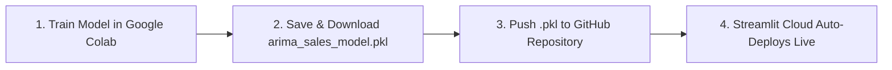

# Sales Forecasting App 📈

An interactive Streamlit web dashboard designed to forecast monthly shampoo sales using an ARIMA (AutoRegressive Integrated Moving Average) time-series model.

---

## 🚀 Live Dashboard
Check out the live deployed application here:
👉 **[Sales Forecasting App on Streamlit Cloud](https://salesforecastingapp-7tflcjnwvvzxvlsbsdccbj.streamlit.app/)**

---

## 🛠️ Key Features
- **Interactive Projections**: Select a forecast horizon (1 to 24 months) using the slider control.
- **KPI Metrics Dashboard**: View key stats such as *Last Actual Sales*, *Next Month's Forecasted Sales*, and *Trend Percentage*.
- **Interactive Visualization**: Interactive time-series charts powered by Plotly comparing historical sales data alongside the forecasted trend line.
- **Data Explorer & Export**: View tabular forecast data and download it directly as a CSV file.
- **Dual Mode (Cloud/Local)**:
  - **Cloud Mode**: Runs the fully trained `statsmodels` ARIMA model on Streamlit Community Cloud.
  - **Local Policy Fallback Mode**: If local Windows security policies block third-party compiled C-extensions (like SciPy/Statsmodels DLLs), the app automatically enters fallback mode, simulating the ARIMA(5,1,0) projections so the UI can still be previewed and tested locally.

---

## 🔄 Machine Learning & Continuous Deployment Workflow

This project is configured with a continuous integration/deployment (CI/CD) workflow linking Google Colab, GitHub, and Streamlit Community Cloud:



### How to Update the Model:
1. Open and run your training code in **Google Colab**.
2. Save the newly trained ARIMA model as `arima_sales_model.pkl` and download it.
3. Upload/push the new `.pkl` file to the root of your GitHub repository.
4. Streamlit Cloud will automatically detect the commit, reload the model, and update the live website within seconds—no code changes required!

---

## 💻 Tech Stack
- **Dashboard Interface**: Streamlit
- **Forecasting Model**: Statsmodels ARIMA(5, 1, 0)
- **Data Wrangling**: Pandas, NumPy
- **Interactive Plotting**: Plotly

---

## ⚙️ Running Locally
1. Clone the repository:
   ```bash
   git clone https://github.com/manoghnaaa/Sales_Forecasting_App.git
   cd Sales_Forecasting_App
   ```
2. Re-create and activate your virtual environment:
   ```bash
   python -m venv venv
   .\venv\Scripts\activate
   ```
3. Install dependencies:
   ```bash
   pip install -r requirements.txt
   ```
4. Start the dashboard:
   ```bash
   streamlit run app.py
   ```
